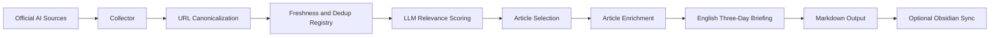

# AI Research Agent

A personal AI research intelligence system for computational social science.

This project collects official AI research updates, filters them through a computational social science (CSS) relevance layer, and generates English Markdown research briefings that can be saved locally or synced to an Obsidian daily notes folder.

The project is intentionally modest in scope. It is not a general web crawler, a literature review engine, or a replacement for academic reading. It is a small research workflow system that helps turn frontier AI updates into structured notes, research questions, and method-oriented signals for further human evaluation.

## Motivation

The system was inspired by a common workflow in computational social science: using language models and other text-processing tools to transform unstructured text into structured, analyzable variables.

In many CSS projects, researchers process large text corpora such as news articles, policy documents, social media posts, organizational records, or platform traces. The goal is often not simply to summarize text, but to encode it into variables such as:

- topic labels
- relevance scores
- issue categories
- uncertainty flags
- actor or institution mentions
- methodological signals
- inferred mechanisms
- research opportunities

This project applies a similar idea to AI research monitoring. Each collected AI update is treated as a text observation. The LLM-based relevance layer converts that observation into a structured record containing fields such as `score`, `categories`, `research_question`, `method`, `main_result`, `research_value`, and `why_relevant_to_user`.

These fields are not treated as ground truth. They are machine-generated annotations that support triage, comparison, and research ideation. The final briefing is therefore best understood as a structured research assistant output, not as an authoritative literature review.

## What It Does

The periodic briefing pipeline performs the following steps:

1. Collect official AI research updates from configured public sources.
2. Normalize and deduplicate article URLs.
3. Apply freshness filtering so old archive pages do not repeatedly enter the workflow.
4. Score each fresh article for relevance to a CSS-oriented research profile.
5. Select a small set of high-value research items and a few general AI technical updates.
6. Enrich selected article text when the official page is accessible.
7. Generate an English research briefing in Markdown.
8. Optionally copy the final report into an Obsidian daily notes folder.

## Architecture



## Core Design Ideas

### 1. Provider-Agnostic LLM Layer

The LLM backend is isolated behind a small client abstraction. The default provider is DeepSeek through an OpenAI-compatible API format. Gemini support is kept optional.

Environment variables:

```env
LLM_PROVIDER=deepseek
LLM_API_KEY=your-api-key
LLM_BASE_URL=https://api.deepseek.com
LLM_MODEL=deepseek-chat
```

### 2. Ingestion Is Separate From Analysis

The ingestion layer only collects article metadata:

- title
- source
- URL
- publication date
- summary
- category

It does not perform deep analysis. This keeps source collection, relevance scoring, and report generation separately testable.

### 3. Freshness and Deduplication

Official AI websites often expose archive links, navigation links, policy pages, repeated announcements, and older articles. The registry stores canonical URLs, normalized titles, content hashes, publication metadata, and processing state.

This helps prevent:

- repeated processing of the same article
- accidental inclusion of historical archive pages
- duplicate article variants caused by tracking parameters
- repeated periodic reports containing the same item

The registry is local and ignored by Git.

### 4. LLM-Based Relevance Scoring as Text Annotation

The relevance layer asks the model to convert each article into a structured JSON-like research annotation:

```json
{
  "score": 0,
  "categories": [],
  "research_question": "",
  "method": "",
  "main_result": "",
  "research_value": "",
  "research_value_score": {
    "novelty": 0,
    "methodological_contribution": 0,
    "relevance_to_css": 0,
    "future_research_proposal_potential": 0
  },
  "why_relevant_to_user": ""
}
```

This resembles automated text coding in empirical research. A language model reads unstructured text and produces structured variables that can be inspected, sorted, filtered, and audited.

However, the output is not assumed to be objectively correct. It should be treated as model-assisted annotation that requires human validation, especially for claims about methods, results, citations, and theory.

### 5. AI-Based CSS Research Orientation

The project profile prioritizes AI-based CSS methods rather than defaulting to traditional econometric designs. The report prompts emphasize:

- LLM-based social simulation
- agent-based modeling
- multi-agent systems
- computational social modeling
- NLP for social science
- network analysis
- digital trace data
- human-AI interaction experiments
- platform behavior modeling

Econometric tools such as DID, IV, and panel regression can still appear, but only as auxiliary validation strategies when appropriate. They are not the default research imagination of the system.

## Current Default Sources

The public configuration currently includes official AI research organization sources such as:

- Anthropic Research
- OpenAI Research / News
- Google DeepMind Blog
- Microsoft Research Blog
- Meta AI Research
- IBM Research AI

Academic conference sources are not enabled by default because public proceedings pages and feeds can be unstable or blocked. They can be added later as a separate academic ingestion module.

## Output

The report is a UTF-8 Markdown file, for example:

```text
output/daily/2026-07-15_AI_Research_Three_Day_Briefing.md
```

The report is designed for academic research note-taking and includes:

- AI industry signals
- key concepts
- CSS-oriented research or technical detail
- CSS research directions
- information boundaries and verification notes

## Installation

Python 3.12 is recommended.

```powershell
py -3.12 -m venv .venv
.\.venv\Scripts\Activate.ps1
python -m pip install --upgrade pip
python -m pip install -r requirements.txt
Copy-Item .env.example .env
notepad .env
```

Add your local API key to `.env`:

```env
LLM_API_KEY=your-real-api-key
```

Do not commit `.env`.

## CLI Usage

Analyze a local Markdown or text file:

```powershell
$env:PYTHONPATH='src'
python -m ai_research_agent analyze examples/sample_article.md
```

Collect official AI updates:

```powershell
$env:PYTHONPATH='src'
python -m ai_research_agent collect
```

Run the full briefing pipeline manually:

```powershell
$env:PYTHONPATH='src'
python -m ai_research_agent daily
```

The command is named `daily` for backward compatibility with the original local workflow, but the default report is a three-day briefing.

Run and sync to an Obsidian daily notes folder:

```powershell
$env:PYTHONPATH='src'
python -m ai_research_agent daily --sync-daily-kb --daily-kb-path "D:\path\to\your\obsidian\vault\01 Daily"
```

The default configuration uses a five-day freshness window. For sources that do not publish high-value research updates every day, the recommended schedule is to run the pipeline every three days.

Preview cleanup of old generated artifacts:

```powershell
$env:PYTHONPATH='src'
python -m ai_research_agent maintenance cleanup
```

Actually delete matched cleanup artifacts:

```powershell
$env:PYTHONPATH='src'
python -m ai_research_agent maintenance cleanup --confirm
```

## Windows Automation

A helper script is provided:

```powershell
powershell.exe -NoProfile -ExecutionPolicy Bypass -File "scripts\run_daily_to_ob.ps1"
```

The script assumes:

- `.venv` exists in the project root
- `.env` exists in the project root
- `OBSIDIAN_DAILY_KB_PATH` is configured if Obsidian sync is enabled

The script writes logs under `logs/`, which is ignored by Git.

## Testing

```powershell
python -m compileall src
.\.venv\Scripts\python.exe -m pytest
.\.venv\Scripts\python.exe -m ruff check .
```

The tests mock external APIs and should not call the real LLM provider.

## Data and Privacy

The repository is designed so local runtime artifacts are ignored by Git:

- `.env`
- `data/`
- `logs/`
- `output/`
- `.venv/`
- SQLite registries
- generated three-day reports

Before publishing a fork or project copy, scan for local paths and secrets:

```powershell
rg -n "LLM_API_KEY|API_KEY|secret|token|D:\\|Users\\" . --hidden -g "!.venv/**" -g "!data/**" -g "!logs/**" -g "!output/**"
```

## Limitations

- The system depends on public source availability. Some sites may block requests or change markup.
- LLM relevance scores are annotations, not validated labels.
- The generated report can miss important work if a source is unavailable or if the item falls outside the freshness window.
- The system should not be used as a citation generator. Citations and factual claims require manual verification.
- The current implementation focuses on official AI organization sources, not a full academic literature database.

## Project Status

This is a personal research workflow project. It is suitable for demonstrating applied AI engineering, text-processing workflows, and research-oriented automation, but it is not a production-grade research database.

## License

MIT License.
